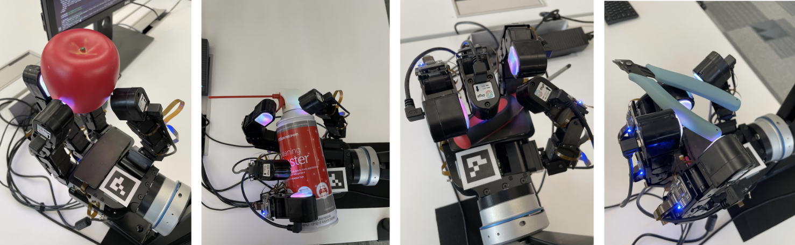
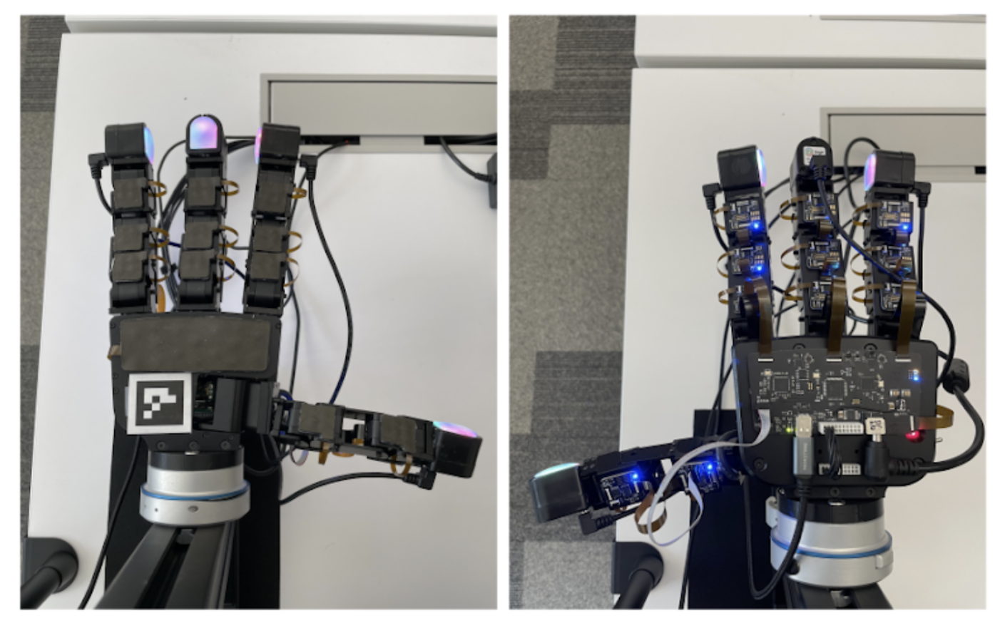

# Meta Digit Plexus
##### A robotics hardware platform for the integration sensors and end effectors into a common platform.

    <a href="https://digit.ml/plexus.html"></img></a>

Digit Plexus aims to create a standardized platform that provides a hardware-software solution to integrate tactile sensors on any robot hand. The platform interfaces vision-based and skin-based tactile sensors like Digit, Digit 360, and [ReSkin](https://reskin.dev) across fingertips, fingers, and palm, into control boards to encode all data to a host computer. The software integration and hardware components of the platform allows for seamless data collection, control and analysis over a single cable.

## Standardized Platform

We propose and implement variations of the Digit Plexus standardized architecture found [here](./docs/digit-plexus.pdf)

The [advanced](./hardware/schematics/advanced/) variation of the architecture allows for a modular implementation to support any custom sense patch configuration where each link is connected via USB to the hand logic motherboard. 

Additionally, actions may be provided to a robotic end effector or hand via multiple methods such as: CAN, USB, I2C. 

#### Partnerships

We have partnered with Wonik Robotic's to develop a next generation Allegro Hand based off of the Digit Plexus platform. For early access, interest may be expressed through this [form](https://digit.ml/plexus).

## Usage

Design files for **basic** (rigid based) and **advanced** (flex) are found in the [hardware](./hardware/) folder of the repository. Furthermore, we provide the Altium Designer ECAD templates which can be used to create a custom sensor patch configuration for the hand, links or fingertips. 

### Sense and Hand Patch

Mechanical sense patch files for 3D printing or mold design are found in the [mechanical](./mechanical/) folder. Depending on the application, or the preferred sensing modality, you may use a similar technique to ReSkin (magnetic particulate infused silicone) or an alternative composition of silicone for forming the sensing surface interacting with the sense patch. We recommend attaching the sense patches to the base end effector with a 3M 300LSE double sided adhesive. 

### Fingertip Sensing

The Digit Plexus platform supports Digit tactile sensors as well as any alternative sensor based on a USB2.0 connection as shown [here](./docs/digit-plexus-digit-v1.pdf).

## 🛠️Installation and setup
Digit Plexus contains a USB hub device which will enumerate all devices connected to the [base](./hardware/base).

Currently, this supports the [Allegro Hand](https://www.allegrohand.com/) and the [next generation Allegro Hand](https://digit.ml/plexus.html) in partnership with Meta.

Digit Plexus provides a new interface for controlling the Allegro Hand directly through a Python interface, as well provides a ROS2 integration.

Installation and usage instructions are found [here](./plexus/README.md).

## Related Works using Digit Plexus plartform
* [Neural feels with neural fields: Visuo-tactile perception for in-hand manipulation, Sudharshan Suresh et al.](https://suddhu.github.io/neural-feels/)
* [Learning In-Hand Translation Using Tactile Skin With Shear and Normal Force Sensing, Jessica Yin et al.](https://jessicayin.github.io/tactile-skin-rl/)

## License
This project is licensed under [LICENSE](LICENSE).

